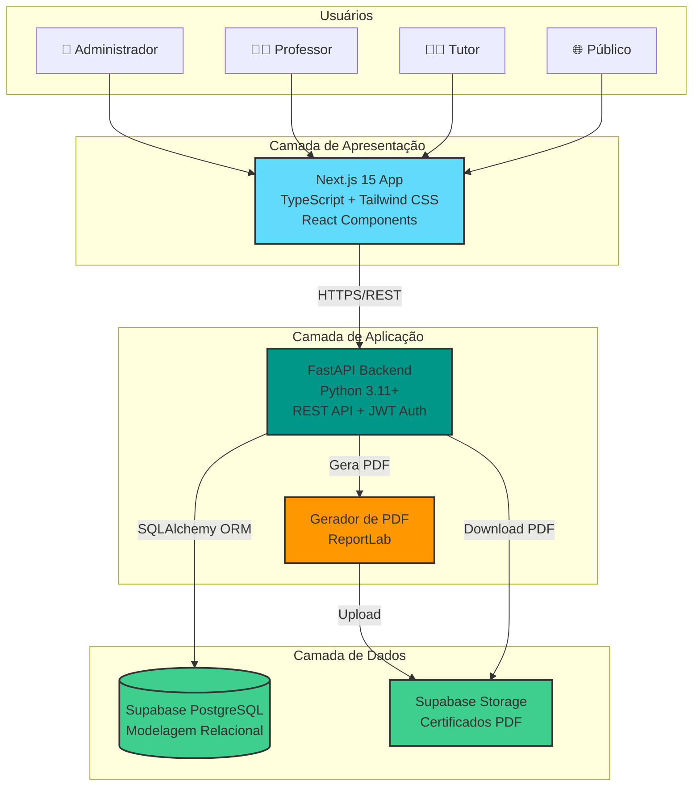
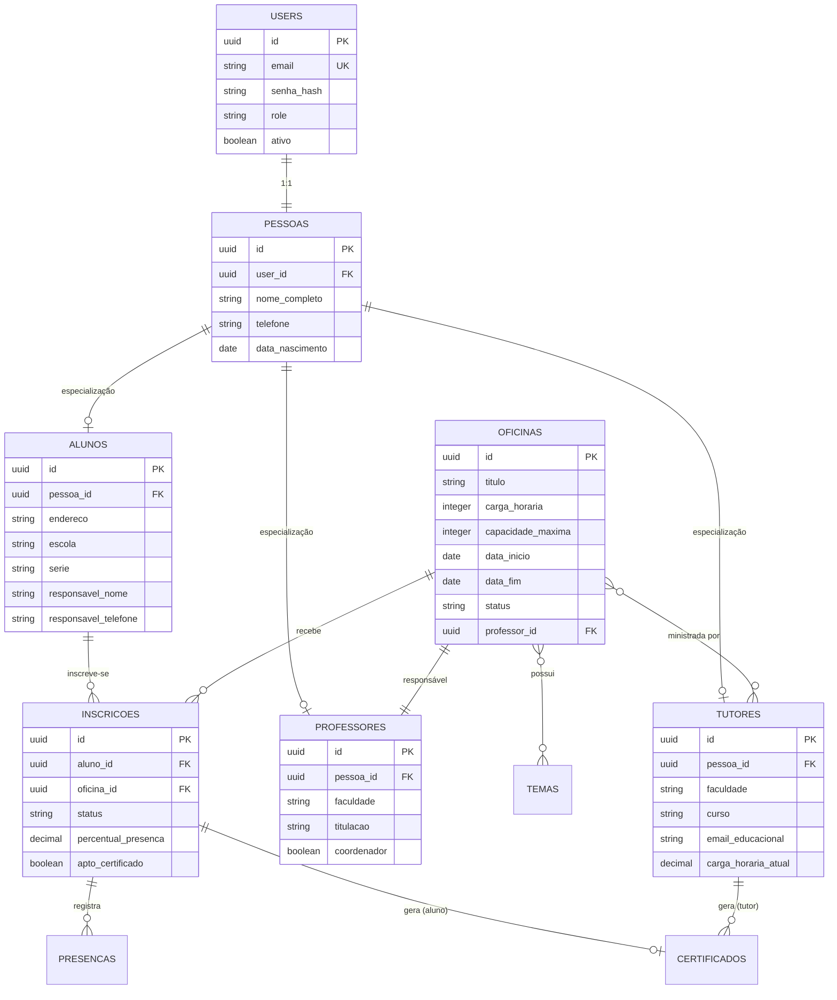
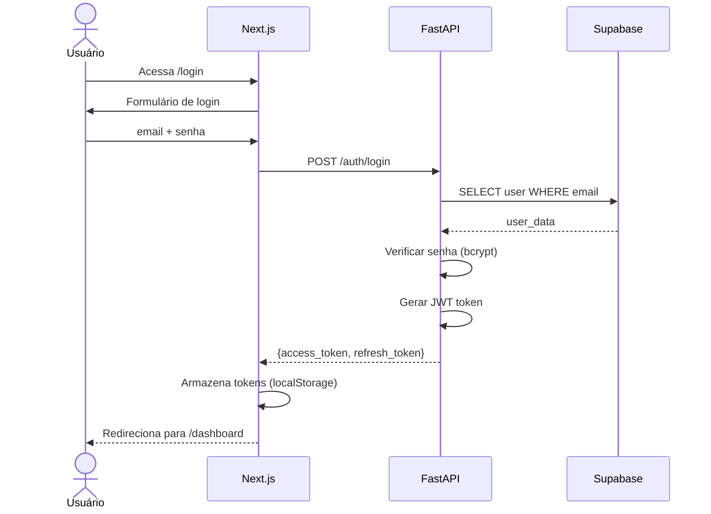
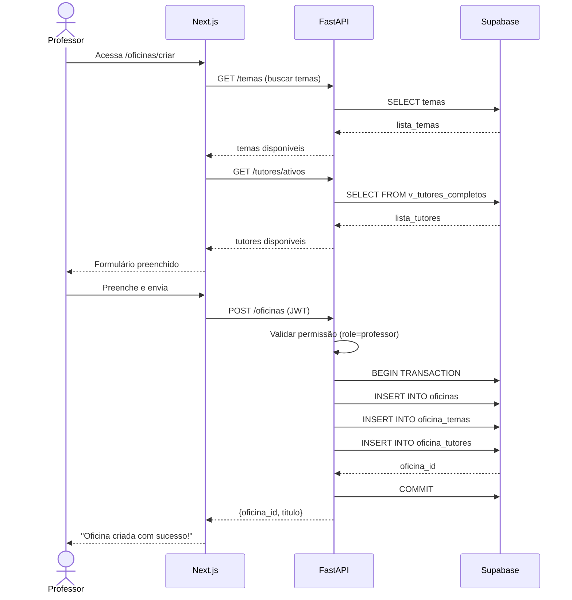
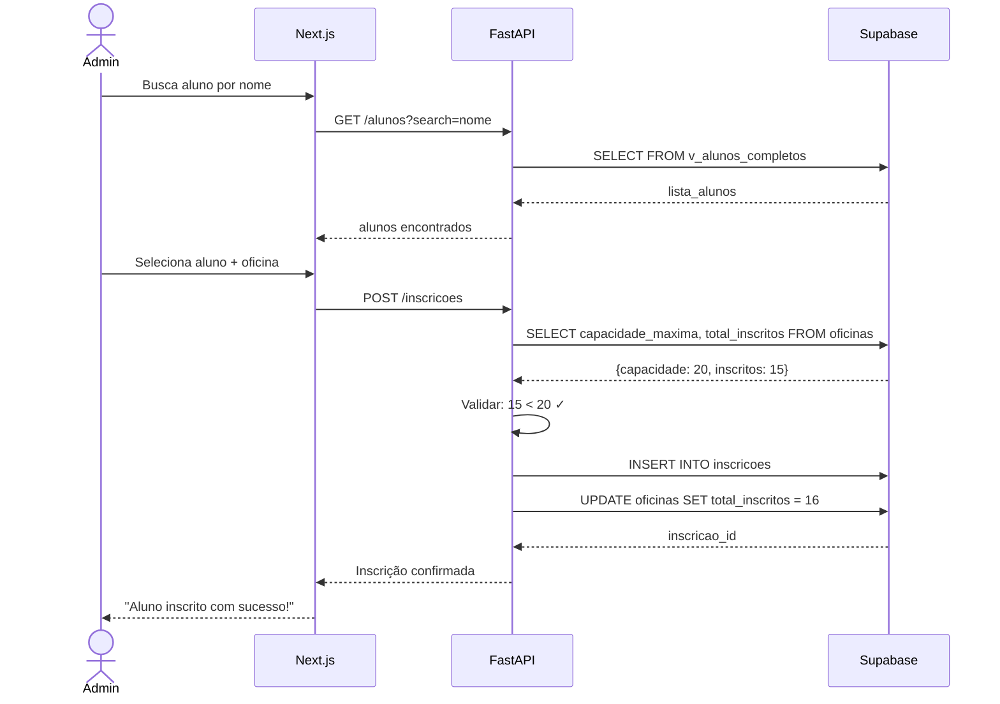
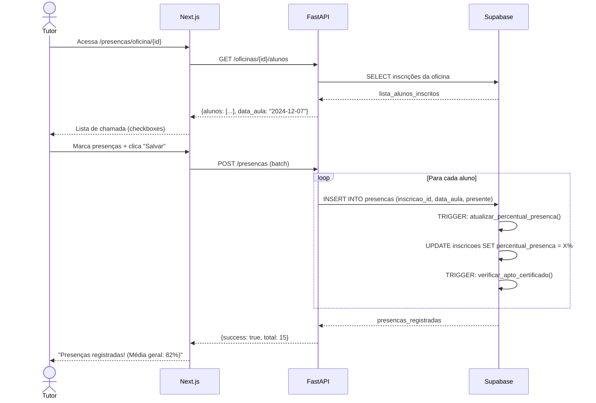
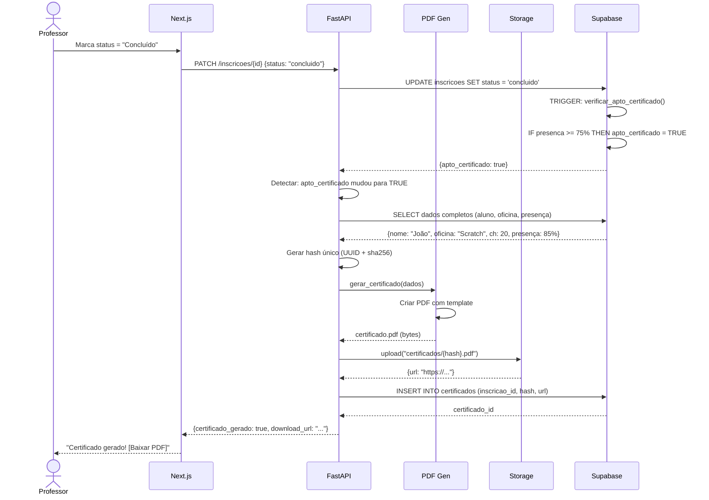
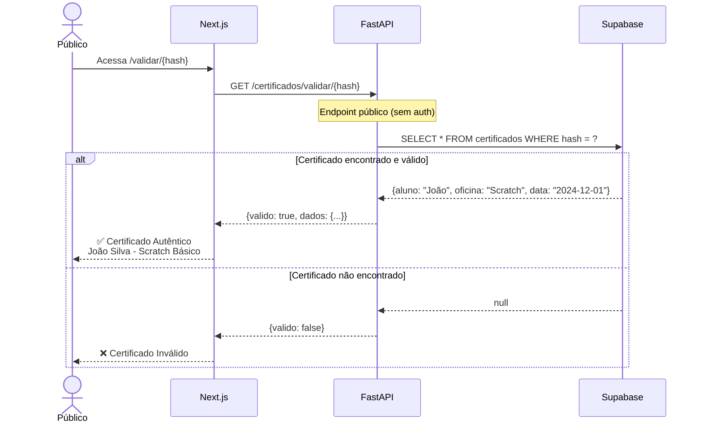

# Arquitetura do Sistema - ELLP Management System

## 📐 Visão Geral da Arquitetura

### Arquitetura em 3 Camadas



---

## 🗄️ Modelagem do Banco de Dados

### Diagrama Entidade-Relacionamento (Simplificado)



### Especialização de Entidades (Class Table Inheritance)

```
         ┌─────────────┐
         │    USERS    │
         │  (auth)     │
         └──────┬──────┘
                │ 1:1
                ▼
         ┌─────────────┐
         │   PESSOAS   │
         │  (comum)    │
         └──────┬──────┘
                │ 1:1
        ┌───────┼───────┐
        ▼       ▼       ▼
    ┌────────┐ ┌────────┐ ┌────────────┐
    │ ALUNOS │ │TUTORES │ │PROFESSORES │
    │        │ │        │ │            │
    │escola  │ │facul-  │ │titulação   │
    │resp_*  │ │dade    │ │coorden.    │
    └────────┘ └────────┘ └────────────┘
```

**Justificativa**: Alunos (crianças), Tutores (universitários) e Professores (docentes) são entidades fundamentalmente diferentes com atributos específicos. Class Table Inheritance evita campos NULL e permite extensibilidade.

---

## 🔄 Fluxos Principais do Sistema

### Fluxo 1: Autenticação



### Fluxo 2: Criação de Oficina



### Fluxo 3: Inscrição de Aluno



### Fluxo 4: Registro de Presença



### Fluxo 5: Geração Automática de Certificado



### Fluxo 6: Validação Pública de Certificado



---

## 📁 Estrutura de Diretórios do Projeto

```
ellp-management-system/
│
├── backend/
│   ├── app/
│   │   ├── __init__.py
│   │   ├── main.py                    # Entry point FastAPI
│   │   ├── config.py                  # Configurações (env)
│   │   ├── database.py                # Conexão Supabase
│   │   │
│   │   ├── models/                    # SQLAlchemy Models
│   │   │   ├── __init__.py
│   │   │   ├── user.py               # User (autenticação)
│   │   │   ├── pessoa.py             # Pessoa (base comum)
│   │   │   ├── aluno.py              # Aluno (especialização)
│   │   │   ├── tutor.py              # Tutor (especialização)
│   │   │   ├── professor.py          # Professor (especialização)
│   │   │   ├── tema.py
│   │   │   ├── oficina.py
│   │   │   ├── inscricao.py
│   │   │   ├── presenca.py
│   │   │   └── certificado.py
│   │   │
│   │   ├── schemas/                   # Pydantic Schemas (DTOs)
│   │   │   ├── __init__.py
│   │   │   ├── user.py               # UserCreate, AlunoCreate, etc
│   │   │   ├── oficina.py
│   │   │   ├── inscricao.py
│   │   │   └── certificado.py
│   │   │
│   │   ├── routers/                   # Endpoints (Controllers)
│   │   │   ├── __init__.py
│   │   │   ├── auth.py               # POST /auth/login
│   │   │   ├── users.py              # CRUD usuários
│   │   │   ├── oficinas.py           # CRUD oficinas
│   │   │   ├── inscricoes.py         # Gerenciar inscrições
│   │   │   ├── presencas.py          # Registrar presença
│   │   │   ├── certificados.py       # Gerar/validar certificados
│   │   │   └── relatorios.py         # Relatórios e dashboard
│   │   │
│   │   ├── services/                  # Business Logic
│   │   │   ├── __init__.py
│   │   │   ├── auth_service.py       # Login, JWT
│   │   │   ├── user_service.py       # Criar aluno/tutor (transações)
│   │   │   ├── oficina_service.py    # Lógica de oficinas
│   │   │   ├── inscricao_service.py  # Validar capacidade, etc
│   │   │   ├── presenca_service.py   # Calcular %, verificar apto
│   │   │   └── certificado_service.py # Gerar PDF, hash, upload
│   │   │
│   │   ├── middlewares/
│   │   │   ├── __init__.py
│   │   │   └── auth_middleware.py    # Verificar JWT, RBAC
│   │   │
│   │   └── utils/
│   │       ├── __init__.py
│   │       ├── security.py           # Hash senha, gerar JWT
│   │       ├── validators.py         # Validações customizadas
│   │       └── pdf_template.py       # Template do certificado
│   │
│   ├── tests/
│   │   ├── __init__.py
│   │   ├── conftest.py               # Fixtures pytest
│   │   ├── test_auth.py
│   │   ├── test_users.py
│   │   ├── test_oficinas.py
│   │   ├── test_inscricoes.py
│   │   ├── test_presencas.py
│   │   └── test_certificados.py
│   │
│   ├── requirements.txt
│   ├── .env.example
│   └── README.md
│
├── frontend/
│   ├── app/                           # Next.js App Router
│   │   ├── layout.tsx                # Layout raiz
│   │   ├── page.tsx                  # Homepage
│   │   ├── login/
│   │   │   └── page.tsx
│   │   ├── dashboard/
│   │   │   └── page.tsx              # Dashboard admin
│   │   ├── usuarios/
│   │   │   ├── page.tsx              # Listar usuários
│   │   │   ├── criar/
│   │   │   │   └── page.tsx          # Criar usuário
│   │   │   └── [id]/
│   │   │       └── page.tsx          # Editar usuário
│   │   ├── oficinas/
│   │   │   ├── page.tsx              # Catálogo
│   │   │   ├── criar/
│   │   │   │   └── page.tsx
│   │   │   └── [id]/
│   │   │       ├── page.tsx          # Detalhes
│   │   │       └── presenca/
│   │   │           └── page.tsx      # Chamada
│   │   ├── inscricoes/
│   │   │   └── page.tsx              # Inscrever alunos
│   │   ├── certificados/
│   │   │   └── page.tsx              # Listar certificados
│   │   └── validar/
│   │       └── [hash]/
│   │           └── page.tsx          # Validação pública
│   │
│   ├── components/
│   │   ├── ui/                       # Componentes base (Button, Input)
│   │   ├── forms/                    # Formulários reutilizáveis
│   │   ├── layouts/                  # Header, Sidebar, Footer
│   │   └── charts/                   # Gráficos (dashboard)
│   │
│   ├── lib/
│   │   ├── api.ts                    # Cliente API (fetch wrapper)
│   │   ├── supabase.ts               # Cliente Supabase
│   │   └── auth.ts                   # Context de autenticação
│   │
│   ├── types/
│   │   └── index.ts                  # TypeScript types
│   │
│   ├── public/
│   │   ├── logo-ellp.png
│   │   └── images/
│   │
│   ├── .env.local.example
│   ├── next.config.js
│   ├── tailwind.config.js
│   ├── tsconfig.json
│   └── package.json
│
├── .github/
│   └── workflows/
│       ├── backend-ci.yml            # CI/CD backend
│       └── frontend-ci.yml           # CI/CD frontend
│
├── docs/
│   ├── requirements.md               # Requisitos funcionais
│   ├── decisoes_arquiteturais.md    # Análise de alternativas
│   ├── schema_supabase_v2.sql       # Schema do banco
│   └── api_endpoints.md             # Documentação da API
│
├── .gitignore
└── README.md
```

---

## 🔌 Endpoints da API (Resumo)

### Autenticação
```
POST   /auth/login           # Login (retorna JWT)
POST   /auth/refresh         # Renovar token
POST   /auth/logout          # Logout
```

### Usuários (Especialização)
```
POST   /users/alunos         # Criar aluno (user + pessoa + aluno)
POST   /users/tutores        # Criar tutor (user + pessoa + tutor)
POST   /users/professores    # Criar professor (user + pessoa + professor)
GET    /users/alunos         # Listar alunos
GET    /users/alunos/{id}    # Detalhes aluno (c/ JOINs)
GET    /users/tutores/ativos # Tutores com status='Ativo'
```

### Temas
```
GET    /temas                # Listar temas
POST   /temas                # Criar tema (admin)
PATCH  /temas/{id}           # Editar tema
DELETE /temas/{id}           # Deletar tema
```

### Oficinas
```
GET    /oficinas             # Listar (c/ filtros: tema, status, período)
POST   /oficinas             # Criar oficina
GET    /oficinas/{id}        # Detalhes
PATCH  /oficinas/{id}        # Atualizar
DELETE /oficinas/{id}        # Deletar
GET    /oficinas/{id}/alunos # Alunos inscritos
```

### Inscrições
```
POST   /inscricoes           # Inscrever aluno (valida capacidade)
GET    /inscricoes/{id}      # Detalhes inscrição
PATCH  /inscricoes/{id}      # Atualizar status/progresso
DELETE /inscricoes/{id}      # Cancelar inscrição
```

### Presença
```
POST   /presencas            # Registrar presença (trigger % automático)
GET    /presencas/oficina/{id}   # Presença de uma oficina
GET    /presencas/aluno/{id}     # Presença de um aluno
```

### Certificados
```
GET    /certificados                # Listar certificados
GET    /certificados/{id}/download # Download PDF
GET    /certificados/validar/{hash} # Validação pública (sem auth)
POST   /certificados/tutor         # Gerar cert. tutor manual
```

### Relatórios
```
GET    /relatorios/frequencia/{oficina_id}  # Relatório de presença
GET    /relatorios/certificados             # Certificados emitidos
GET    /dashboard/metricas                  # Métricas gerais
```

---

## 🔒 Segurança e Autenticação

### RBAC (Role-Based Access Control)

| Endpoint | Admin | Professor | Tutor | Aluno | Público |
|----------|-------|-----------|-------|-------|---------|
| POST /oficinas | ✅ | ✅ | ❌ | ❌ | ❌ |
| POST /inscricoes | ✅ | ✅ | ✅ | ❌ | ❌ |
| POST /presencas | ✅ | ✅ | ✅ | ❌ | ❌ |
| GET /certificados | ✅ | ✅ | ✅ | Ver próprios | ❌ |
| GET /validar/{hash} | ✅ | ✅ | ✅ | ✅ | ✅ |
| POST /users/* | ✅ | ❌ | ❌ | ❌ | ❌ |

### Middleware de Autenticação

```python
@router.post("/oficinas")
async def criar_oficina(
    oficina: OficinaCreate,
    db: Session = Depends(get_db),
    current_user = Depends(require_role(['admin', 'professor']))  # ← RBAC
):
    # Apenas admin e professor podem criar oficinas
    ...
```

---

## 🧪 Estratégia de Testes

### Backend (pytest):

```
tests/
├── test_auth.py
│   ├── test_login_success
│   ├── test_login_invalid_password
│   └── test_token_refresh
│
├── test_users.py
│   ├── test_create_aluno_completo           # Transação: user+pessoa+aluno
│   ├── test_create_tutor_com_validacao      # Valida carga horária
│   └── test_buscar_aluno_com_joins          # Testa JOIN de 3 tabelas
│
├── test_oficinas.py
│   ├── test_create_oficina_as_professor
│   ├── test_create_oficina_as_tutor_forbidden  # RBAC
│   └── test_inscricao_excede_capacidade
│
├── test_presencas.py
│   ├── test_calcular_percentual_presenca    # 4 de 5 aulas = 80%
│   └── test_trigger_apto_certificado        # >= 75% + concluído
│
└── test_certificados.py
    ├── test_gerar_certificado_automatico
    ├── test_hash_unico
    └── test_validar_certificado_publico
```

**Meta de Cobertura**: >80%

---

## Princípios Arquiteturais e Decisões Tecnológicas

### Princípios Arquiteturais
- **APIs first**: backend FastAPI define contratos (OpenAPI) consumidos pelo frontend e futuros integradores.
- **Separation of concerns**: Frontend (Next.js) trata UI/UX, Backend encapsula regras de negócio, Supabase gerencia dados e storage.
- **Security by design**: RBAC baseado em JWT, RLS no Supabase e armazenamento seguro de certificados.
- **Automation ready**: estrutura preparada para pipelines de testes (pytest, Playwright) e CI/CD no GitHub Actions.

### Stack Tecnológica
| Camada | Tecnologia | Função |
|--------|------------|--------|
| Frontend | Next.js 15 (App Router) + TypeScript + Tailwind CSS | Interface administrativa e página pública de validação de certificados |
| Backend/API | FastAPI (Python 3.11+) + SQLAlchemy + Pydantic | Regras de negócio, autenticação, geração de certificados |
| Banco de Dados | Supabase PostgreSQL + RLS + Views | Persistência das entidades (users, oficinas, inscrições, presenças, certificados) |
| Storage | Supabase Storage | Armazenamento dos PDFs de certificados e artefatos gerados |
| Autenticação | JWT (access + refresh) + RBAC | Proteção de rotas e segregação de perfis (admin, professor, tutor) |
| Observabilidade | Logging estruturado (uvicorn + loguru), Supabase Audit | Auditoria de ações críticas |
| Infra/Dev Experience | Docker Compose, Makefile, GitHub Actions | Empacotamento local, lint/test pipelines |

## Fluxo de Dados e Comunicação

### Componentes e Responsabilidades
| Componente | Responsabilidade | Tecnologias |
|------------|------------------|-------------|
| `frontend/app` | UI protegida (dashboard, cadastros) e página pública `/validar/[hash]` | Next.js, React Hook Form, Zod, Zustand |
| `frontend/lib/api.ts` | Cliente HTTP tipado consumindo FastAPI | Axios/fetch + zodios |
| `backend/app/routers` | Endpoints REST (auth, users, oficinas, inscrições, presenças, certificados) | FastAPI Routers |
| `backend/app/services` | Regras de negócio (cálculo de presença, elegibilidade de certificado) | Python, SQLAlchemy |
| `backend/app/models` | Mapeamento ORM (Class Table Inheritance: users, pessoas, alunos, tutores, professores) | SQLAlchemy 2.0 |
| `backend/app/utils/pdf_generator.py` | Templates e geração de PDFs | ReportLab ou WeasyPrint |
| `supabase/schema.sql` | Script de criação/alteração do banco | SQL padrão PostgreSQL |
| `.github/workflows` | CI (lint, testes, build) | GitHub Actions |

### Mapeamento Requisito → Componente
| Requisito | Backend | Frontend | Observações |
|-----------|---------|----------|-------------|
| RF-001/002/019 | `routers/auth.py`, `services/auth_service.py`, `middlewares/rbac.py` | Páginas `login` e guardas de rota | JWT + RBAC |
| RF-003/004/010/011/012 | `routers/oficinas.py`, `models/oficina.py` | `app/oficinas/*` | Filtros, associações |
| RF-005/013 | `routers/inscricoes.py` | `app/alunos/inscricoes` | Inscrição administrativa |
| RF-007/031/032 | `routers/presencas.py`, `services/progresso_service.py` | `app/presencas` | Atualiza % e status |
| RF-008/033/034/035/009 | `routers/certificados.py`, `services/certificado_service.py` | `app/certificados`, `public/validar/[hash]` | Geração, download, validação |
| RF-014/015/022 | `routers/relatorios.py` | `app/dashboard` | Exportação CSV e cards |
| RF-018/021 | `routers/auditoria.py`, logging | `app/auditoria` (opcional) | Logs e exportações |

### Integração com Supabase
- **Conexão**: via chave service role (backend) e chave anon (frontend somente para validação pública quando necessário).
- **RLS**: políticas específicas por tabela para garantir que apenas perfis válidos acessem registros.
- **Storage**: bucket `certificados` com permissão pública READ e escrita restrita ao backend usando service key.
- **Jobs/Triggers**: Função PostgreSQL ou cron job (via FastAPI + APScheduler) para checar inscrições aptas e disparar geração de certificados.

### Considerações de Deploy
| Ambiente | Backend | Frontend | Banco |
|----------|---------|----------|-------|
| Local | Docker Compose (FastAPI + Traefik) | `npm run dev` | Supabase Cloud |
| Homologação | Railway/Render (uvicorn + gunicorn) | Vercel Preview | Supabase project staging |
| Produção | Vercel/Netlify (SSG + revalidate) | Vercel | Supabase produção |

#### Variáveis sensíveis
- `SUPABASE_URL`, `SUPABASE_ANON_KEY`, `SUPABASE_SERVICE_KEY`
- `JWT_SECRET`, `JWT_REFRESH_SECRET`
- Buckets + URLs do storage

### Riscos e Mitigações
| Risco | Mitigação |
|-------|-----------|
| Latência entre FastAPI e Supabase (cloud separada) | Manter pool de conexões, usar caching leve (Redis future) |
| Geração de PDF lenta | Processar de forma assíncrona (BackgroundTasks) e enviar notificação quando concluído |
| Dados sensíveis de crianças | Criptografar/mascarar dados de responsáveis, aplicar LGPD, restringir acessos |
| Falha no storage | Reprocessar certificados a partir dos dados (hash + template) |
| Mudança de escopo | Documentar supostos no README e validar com professor antes de alterar arquitetura |

---

## 🚀 Tecnologias e Justificativas

| Tecnologia | Justificativa |
|------------|---------------|
| **FastAPI** | Performance, OpenAPI automático, type hints nativos |
| **Supabase** | PostgreSQL robusto, Storage integrado, RLS para segurança |
| **SQLAlchemy** | ORM maduro, suporta JOINs complexos para Class Table |
| **Next.js 15** | SSR/SSG, App Router, melhor SEO e performance |
| **TypeScript** | Type safety completo (frontend + backend com Pydantic) |
| **Tailwind CSS** | Produtividade, consistência de design |
| **pytest** | Framework de testes mais usado em Python |
| **ReportLab** | Geração de PDF profissional, flexível |

---

## 📊 Métricas de Qualidade Esperadas

### Código:
- ✅ Cobertura de testes >80%
- ✅ 0 linter errors (flake8 + ESLint)
- ✅ 0 security vulnerabilities (pip audit + npm audit)
- ✅ Documentação OpenAPI completa

### Performance:
- ✅ Tempo de resposta API <200ms (95º percentil)
- ✅ Views otimizam JOINs (3 tabelas → 1 query)
- ✅ Índices em FKs garantem JOIN rápido

### Manutenibilidade:
- ✅ Separação clara de camadas (Models, Services, Routers)
- ✅ Código DRY (Don't Repeat Yourself)
- ✅ Commits atômicos e bem descritos

---

## 🎯 Conclusão

A arquitetura proposta:
1. ✅ Segue padrões profissionais (Class Table Inheritance)
2. ✅ Segue princípios SOLID e normalização correta
3. ✅ É extensível e manutenível
4. ✅ Utiliza stack moderna e adequada ao projeto
5. ✅ Prepara para crescimento futuro sem refatoração massiva
