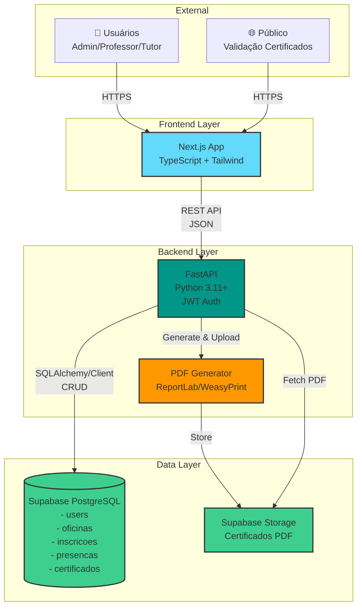
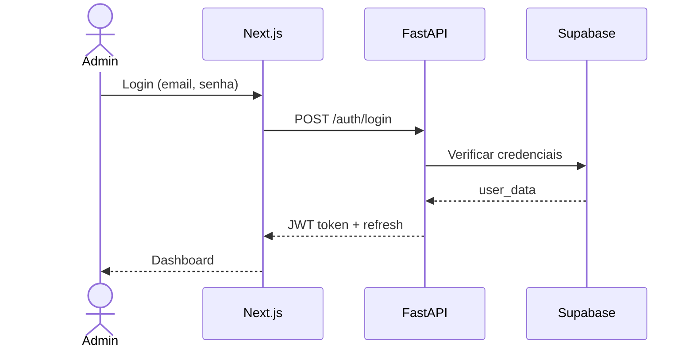
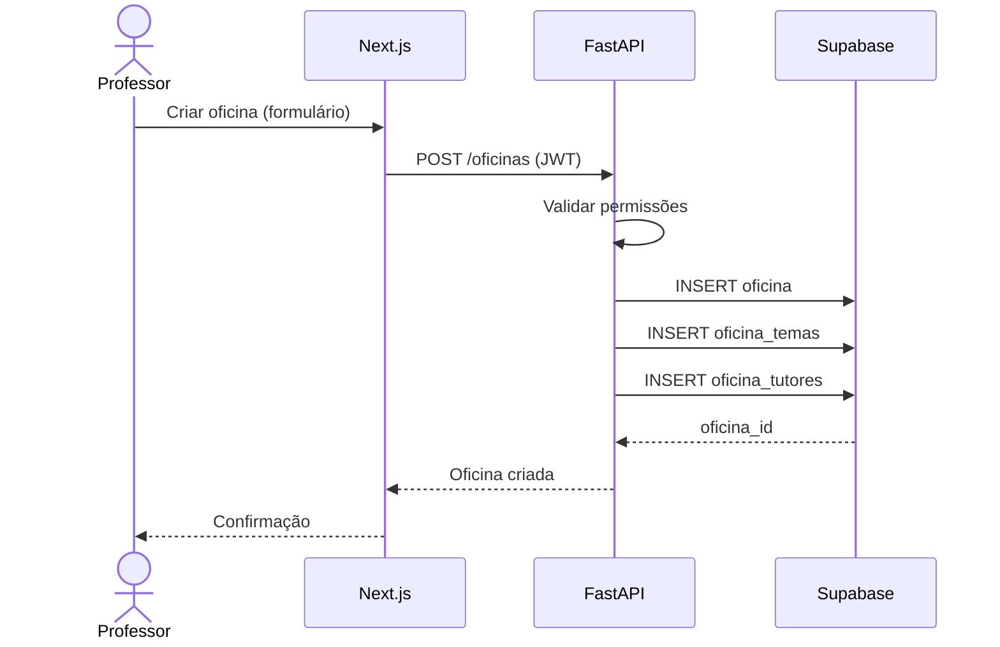
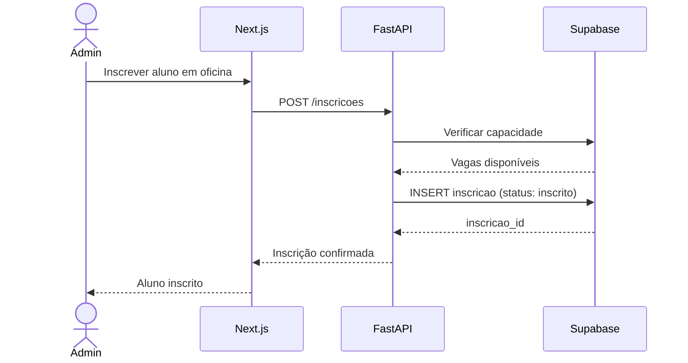
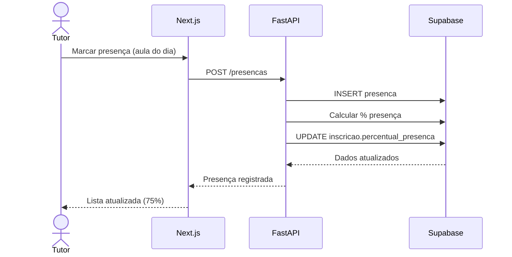
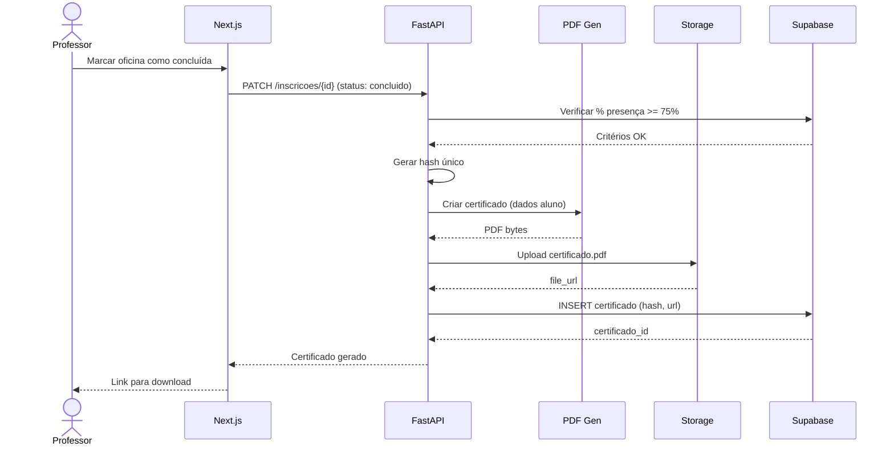
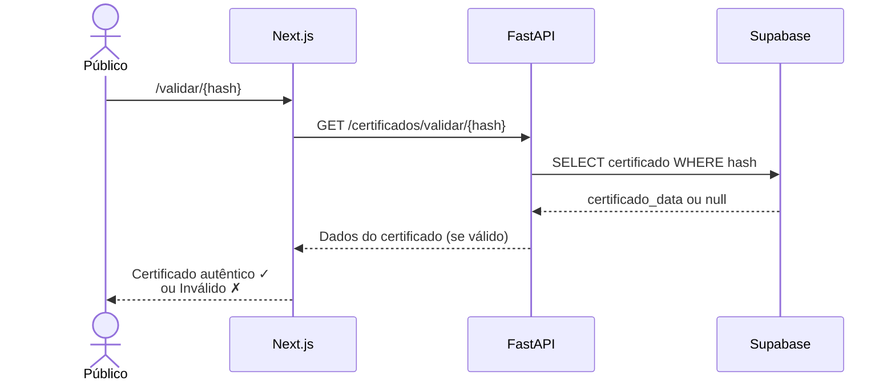

# Single Table Design

This document outlines the architecture and technical stack for the ELLP Management System, focusing on a single table design approach for user entities.

This approach has been substituted in favor of Class Table Inheritance as detailed in the architectural decisions documentation. However, for reference, the single table design is described below.

This design choice simplifies the database schema by consolidating all user types (admins, professors, tutors, students) into a single table with a discriminator column to differentiate between roles.

## Architecture Overview



## Fluxo de Dados Principais

### 1. Cadastro e Autenticação


### 2. Criação de Oficina


### 3. Inscrição de Aluno


### 4. Registro de Presença


### 5. Geração de Certificado (Automática)


### 6. Validação de Certificado (Pública)


## Estrutura de Diretórios Sugerida

```
ellp-management-system/
├── backend/
│   ├── app/
│   │   ├── __init__.py
│   │   ├── main.py                 # Entry point FastAPI
│   │   ├── config.py               # Configurações (env vars)
│   │   ├── database.py             # Conexão Supabase
│   │   ├── models/                 # SQLAlchemy models
│   │   │   ├── __init__.py
│   │   │   ├── user.py
│   │   │   ├── oficina.py
│   │   │   ├── inscricao.py
│   │   │   └── certificado.py
│   │   ├── schemas/                # Pydantic schemas (DTOs)
│   │   │   ├── __init__.py
│   │   │   ├── user.py
│   │   │   ├── oficina.py
│   │   │   └── certificado.py
│   │   ├── routers/                # Endpoints
│   │   │   ├── __init__.py
│   │   │   ├── auth.py
│   │   │   ├── users.py
│   │   │   ├── oficinas.py
│   │   │   ├── inscricoes.py
│   │   │   ├── presencas.py
│   │   │   └── certificados.py
│   │   ├── services/               # Business logic
│   │   │   ├── __init__.py
│   │   │   ├── auth_service.py
│   │   │   ├── oficina_service.py
│   │   │   ├── certificado_service.py
│   │   │   └── pdf_generator.py
│   │   ├── middlewares/
│   │   │   ├── __init__.py
│   │   │   └── auth_middleware.py
│   │   └── utils/
│   │       ├── __init__.py
│   │       ├── security.py         # JWT, hash senhas
│   │       └── validators.py
│   ├── tests/
│   │   ├── __init__.py
│   │   ├── test_auth.py
│   │   ├── test_oficinas.py
│   │   └── test_certificados.py
│   ├── requirements.txt
│   ├── .env.example
│   └── README.md
│
├── frontend/
│   ├── src/
│   │   ├── app/                    # Next.js App Router
│   │   │   ├── layout.tsx
│   │   │   ├── page.tsx            # Home
│   │   │   ├── login/
│   │   │   ├── dashboard/
│   │   │   ├── oficinas/
│   │   │   ├── alunos/
│   │   │   ├── tutores/
│   │   │   ├── presencas/
│   │   │   ├── certificados/
│   │   │   └── validar/[hash]/     # Validação pública
│   │   ├── components/
│   │   │   ├── ui/                 # Componentes reutilizáveis
│   │   │   ├── forms/
│   │   │   └── layouts/
│   │   ├── lib/
│   │   │   ├── api.ts              # Cliente API
│   │   │   ├── supabase.ts
│   │   │   └── auth.ts
│   │   ├── types/
│   │   │   └── index.ts            # TypeScript types
│   │   └── utils/
│   │       └── format.ts
│   ├── public/
│   │   └── images/
│   ├── .env.local.example
│   ├── next.config.js
│   ├── tailwind.config.js
│   ├── tsconfig.json
│   └── package.json
│
├── .github/
│   └── workflows/
│       ├── backend-ci.yml
│       └── frontend-ci.yml
│
├── docs/
│   ├── requirements.md
│   ├── arquitetura.md
│   └── api_docs.md
│
└── README.md
```

## Stack Detalhada

### Backend (Python)
```txt
# requirements.txt
fastapi==0.109.0
uvicorn[standard]==0.27.0
pydantic==2.5.0
pydantic-settings==2.1.0
python-jose[cryptography]==3.3.0
passlib[bcrypt]==1.7.4
python-multipart==0.0.6
supabase==2.3.0
sqlalchemy==2.0.25
reportlab==4.0.9          # ou weasyprint==60.2
pytest==7.4.4
pytest-cov==4.1.0
pytest-asyncio==0.23.3
httpx==0.26.0
```

### Frontend (TypeScript)
```json
{
  "dependencies": {
    "next": "14.1.0",
    "react": "18.2.0",
    "react-dom": "18.2.0",
    "typescript": "5.3.3",
    "@supabase/supabase-js": "2.39.0",
    "zustand": "4.5.0",
    "react-hook-form": "7.49.3",
    "zod": "3.22.4",
    "@tanstack/react-query": "5.17.15",
    "tailwindcss": "3.4.1",
    "lucide-react": "0.312.0"
  }
}
```

## Configuração do Supabase

### Tabelas no Supabase:

```sql
-- users
CREATE TABLE users (
    id UUID PRIMARY KEY DEFAULT gen_random_uuid(),
    nome VARCHAR(255) NOT NULL,
    email VARCHAR(255) UNIQUE NOT NULL,
    senha_hash VARCHAR(255) NOT NULL,
    role VARCHAR(50) NOT NULL CHECK (role IN ('admin', 'professor', 'tutor', 'aluno')),
    telefone VARCHAR(20),
    -- Dados do responsável (apenas para role = 'aluno')
    responsavel_nome VARCHAR(255),
    responsavel_email VARCHAR(255),
    responsavel_telefone VARCHAR(20),
    created_at TIMESTAMP DEFAULT NOW(),
    updated_at TIMESTAMP DEFAULT NOW()
);

-- temas
CREATE TABLE temas (
    id UUID PRIMARY KEY DEFAULT gen_random_uuid(),
    nome VARCHAR(255) NOT NULL,
    descricao TEXT,
    created_at TIMESTAMP DEFAULT NOW()
);

-- oficinas
CREATE TABLE oficinas (
    id UUID PRIMARY KEY DEFAULT gen_random_uuid(),
    titulo VARCHAR(255) NOT NULL,
    descricao TEXT,
    carga_horaria INTEGER NOT NULL,
    capacidade_max INTEGER NOT NULL,
    data_inicio DATE NOT NULL,
    data_fim DATE NOT NULL,
    local VARCHAR(255),
    status VARCHAR(50) DEFAULT 'planejada' CHECK (status IN ('planejada', 'em_andamento', 'concluida', 'cancelada')),
    professor_id UUID REFERENCES users(id),
    created_at TIMESTAMP DEFAULT NOW(),
    updated_at TIMESTAMP DEFAULT NOW()
);

-- oficina_temas (N:N)
CREATE TABLE oficina_temas (
    oficina_id UUID REFERENCES oficinas(id) ON DELETE CASCADE,
    tema_id UUID REFERENCES temas(id) ON DELETE CASCADE,
    PRIMARY KEY (oficina_id, tema_id)
);

-- oficina_tutores (N:N)
CREATE TABLE oficina_tutores (
    oficina_id UUID REFERENCES oficinas(id) ON DELETE CASCADE,
    tutor_id UUID REFERENCES users(id) ON DELETE CASCADE,
    PRIMARY KEY (oficina_id, tutor_id)
);

-- inscricoes
CREATE TABLE inscricoes (
    id UUID PRIMARY KEY DEFAULT gen_random_uuid(),
    aluno_id UUID REFERENCES users(id) ON DELETE CASCADE,
    oficina_id UUID REFERENCES oficinas(id) ON DELETE CASCADE,
    data_inscricao TIMESTAMP DEFAULT NOW(),
    status VARCHAR(50) DEFAULT 'inscrito' CHECK (status IN ('inscrito', 'em_andamento', 'concluido', 'abandonou')),
    percentual_presenca DECIMAL(5, 2) DEFAULT 0.00,
    created_at TIMESTAMP DEFAULT NOW(),
    updated_at TIMESTAMP DEFAULT NOW(),
    UNIQUE (aluno_id, oficina_id)
);

-- presencas
CREATE TABLE presencas (
    id UUID PRIMARY KEY DEFAULT gen_random_uuid(),
    inscricao_id UUID REFERENCES inscricoes(id) ON DELETE CASCADE,
    data_aula DATE NOT NULL,
    presente BOOLEAN NOT NULL,
    observacao TEXT,
    created_at TIMESTAMP DEFAULT NOW(),
    UNIQUE (inscricao_id, data_aula)
);

-- certificados
CREATE TABLE certificados (
    id UUID PRIMARY KEY DEFAULT gen_random_uuid(),
    inscricao_id UUID REFERENCES inscricoes(id) ON DELETE SET NULL,
    tutor_id UUID REFERENCES users(id) ON DELETE SET NULL,
    tipo VARCHAR(50) NOT NULL CHECK (tipo IN ('aluno', 'tutor')),
    data_emissao TIMESTAMP DEFAULT NOW(),
    hash_validacao VARCHAR(255) UNIQUE NOT NULL,
    arquivo_pdf_url TEXT,
    created_at TIMESTAMP DEFAULT NOW()
);

-- auditoria
CREATE TABLE auditoria (
    id UUID PRIMARY KEY DEFAULT gen_random_uuid(),
    user_id UUID REFERENCES users(id) ON DELETE SET NULL,
    acao VARCHAR(255) NOT NULL,
    entidade VARCHAR(100) NOT NULL,
    entidade_id UUID,
    detalhes JSONB,
    created_at TIMESTAMP DEFAULT NOW()
);

-- Índices para performance
CREATE INDEX idx_inscricoes_aluno ON inscricoes(aluno_id);
CREATE INDEX idx_inscricoes_oficina ON inscricoes(oficina_id);
CREATE INDEX idx_presencas_inscricao ON presencas(inscricao_id);
CREATE INDEX idx_certificados_hash ON certificados(hash_validacao);
CREATE INDEX idx_auditoria_user ON auditoria(user_id);
CREATE INDEX idx_auditoria_created ON auditoria(created_at DESC);
```

### Row Level Security (RLS) - Exemplo:

```sql
-- Habilitar RLS
ALTER TABLE oficinas ENABLE ROW LEVEL SECURITY;
ALTER TABLE inscricoes ENABLE ROW LEVEL SECURITY;

-- Admins podem tudo
CREATE POLICY "Admins can do everything" ON oficinas
    FOR ALL
    USING (auth.jwt() ->> 'role' = 'admin');

-- Professores veem suas oficinas
CREATE POLICY "Professores see their oficinas" ON oficinas
    FOR SELECT
    USING (professor_id = auth.uid() OR auth.jwt() ->> 'role' = 'admin');
```

---

## Endpoints da API (Resumo)

```
POST   /auth/login                    # Login
POST   /auth/refresh                  # Refresh token
POST   /auth/logout                   # Logout

GET    /users                         # Listar usuários (admin)
POST   /users                         # Criar usuário (admin)
GET    /users/{id}                    # Detalhes usuário
PATCH  /users/{id}                    # Atualizar usuário
DELETE /users/{id}                    # Deletar usuário (admin)

GET    /temas                         # Listar temas
POST   /temas                         # Criar tema
GET    /temas/{id}                    # Detalhes tema
PATCH  /temas/{id}                    # Atualizar tema
DELETE /temas/{id}                    # Deletar tema

GET    /oficinas                      # Listar oficinas (com filtros)
POST   /oficinas                      # Criar oficina
GET    /oficinas/{id}                 # Detalhes oficina
PATCH  /oficinas/{id}                 # Atualizar oficina
DELETE /oficinas/{id}                 # Deletar oficina
GET    /oficinas/{id}/alunos          # Alunos inscritos
GET    /oficinas/{id}/tutores         # Tutores associados

POST   /inscricoes                    # Inscrever aluno
GET    /inscricoes/{id}               # Detalhes inscrição
PATCH  /inscricoes/{id}               # Atualizar status/progresso
DELETE /inscricoes/{id}               # Cancelar inscrição

POST   /presencas                     # Registrar presença
GET    /presencas/oficina/{id}        # Presença de uma oficina
GET    /presencas/aluno/{id}          # Presença de um aluno
PATCH  /presencas/{id}                # Corrigir presença

GET    /certificados                  # Listar certificados
GET    /certificados/{id}             # Detalhes certificado
GET    /certificados/{id}/download    # Download PDF
GET    /certificados/validar/{hash}   # Validação pública
POST   /certificados/tutor            # Gerar cert. tutor

GET    /relatorios/frequencia/{oficina_id}
GET    /relatorios/certificados
GET    /dashboard/metricas            # Métricas gerais
```
